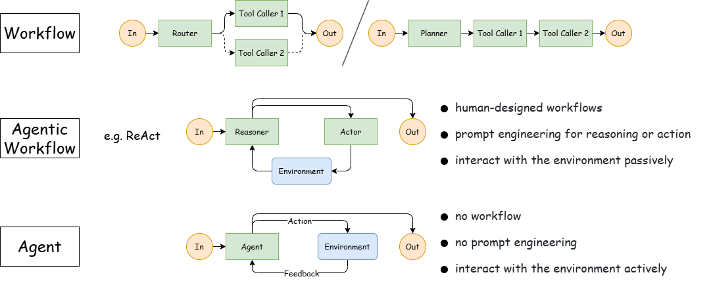
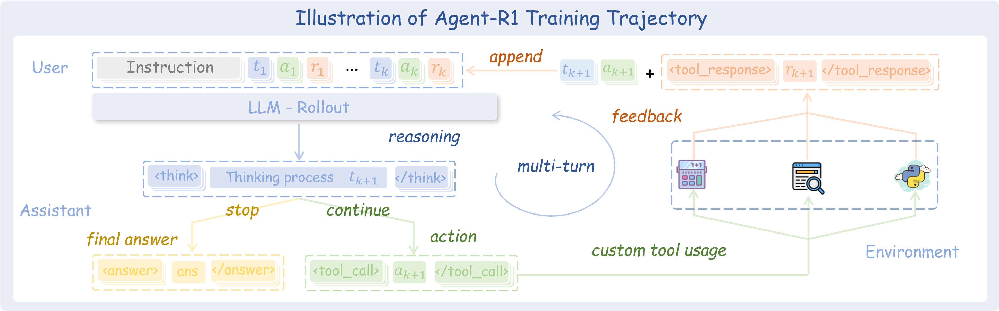

<h1 align="center">Agent-R1</h1>

<div align="center">

### Training Powerful LLM Agents with End-to-End Reinforcement Learning

<p align="center">
  <a href="https://arxiv.org/abs/2511.14460"></a>
  <a href="https://agentr1.github.io/Agent-R1/"></a>
  <a href="https://deepwiki.com/AgentR1/Agent-R1"></a>
  <a href="https://github.com/AgentR1/Agent-R1/stargazers"></a>
  <a href="https://github.com/AgentR1/Agent-R1/network/members"></a>
</p>

</div>

<p align="center"></p>

## News

- [2026.03.23] **The Agent-R1 codebase has been fully refactored.** (The previous version has been archived to the `legacy` branch) This update introduces **Layered Abstractions** (`AgentFlowBase` -> `AgentEnvLoop` -> `ToolEnv`) for a cleaner, object-oriented API. We also formalized the **Step-level MDP** foundation to enable flexible context management during RL training. Please refer to our new [Documentation Site](https://agentr1.github.io/Agent-R1/) for details.

- [2026.03.04] We've launched [Claw-R1](https://agentr1.github.io/Claw-R1/), a more advanced framework designed to empower General Agents (OpenClaw etc.) with Agentic RL through a Middleware design. Check it out at [AgentR1/Claw-R1](https://github.com/AgentR1/Claw-R1).


## Overview

**Agent-R1** is an open-source framework for training powerful language **agents** with **end-to-end reinforcement learning**. With Agent-R1, you can build custom agent workflows, define interactive environments and tools, and train multi-step agents in a unified RL pipeline.

> **Also check out [Awesome-Agent-RL](https://github.com/0russwest0/Awesome-Agent-RL)**: Our curated collection of papers and resources on unlocking the potential of Agents through Reinforcement Learning.

<p align="center"></p>


## Getting Started

Agent-R1 uses the same environment setup as [verl](https://verl.readthedocs.io/en/latest/start/install.html). After preparing that environment, the recommended reading path is:

1. Read the [Getting Started](https://agentr1.github.io/Agent-R1/getting-started/) page for the minimal setup flow.
2. Use [`examples/data_preprocess/gsm8k.py`](examples/data_preprocess/gsm8k.py) and [`examples/run_qwen2.5-3b.sh`](examples/run_qwen2.5-3b.sh) as a sanity check that the environment is wired correctly.
3. Move to the [Agent Task Tutorial](https://agentr1.github.io/Agent-R1/tutorials/agent-task/) for the main Agent-R1 workflow based on multi-step interaction and tool use.

Core concepts:

- [Step-level MDP](https://agentr1.github.io/Agent-R1/core-concepts/step-level-mdp/)
- [Layered Abstractions](https://agentr1.github.io/Agent-R1/core-concepts/layered-abstractions/)

## Awesome Projects Using Agent-R1

Here are some representative projects built on top of Agent-R1:

- **[TableMind](https://arxiv.org/abs/2509.06278)**: An autonomous programmatic agent for tool-augmented table reasoning. TableMind is built upon the Agent-R1 framework and leverages its end-to-end reinforcement learning pipeline to train a specialized agent for structured table understanding.
- **[PaperScout](https://arxiv.org/abs/2601.10029)**: An autonomous agent for academic paper search built with Agent-R1. It introduces Proximal Sequence Policy Optimization (PSPO), a process-aware method for aligning token-level optimization with sequence-level agent interactions.

## Acknowledgements

This work is conducted at the **State Key Laboratory of Cognitive Intelligence, USTC**. We gratefully acknowledge the inspiring ideas and early insights from [DeepSeek-R1](https://github.com/deepseek-ai/DeepSeek-R1), [veRL](https://github.com/volcengine/verl), and [RAGEN](https://github.com/ZihanWang314/ragen), which have significantly influenced the development of Agent-R1. We also sincerely thank [**Prof. Qi Liu**](http://staff.ustc.edu.cn/~qiliuql/) and [**Prof. Mingyue Cheng**](https://mingyue-cheng.github.io/) for their guidance and support.

## Citation

If you find Agent-R1 useful in your research, please cite:

```bibtex
@misc{cheng2025agentr1trainingpowerfulllm,
  title={Agent-R1: Training Powerful LLM Agents with End-to-End Reinforcement Learning},
  author={Mingyue Cheng and Jie Ouyang and Shuo Yu and Ruiran Yan and Yucong Luo and Zirui Liu and Daoyu Wang and Qi Liu and Enhong Chen},
  year={2025},
  eprint={2511.14460},
  archivePrefix={arXiv},
  primaryClass={cs.CL},
  url={https://arxiv.org/abs/2511.14460}
}
```

## Star History

[](https://www.star-history.com/#AgentR1/Agent-R1&Date)
