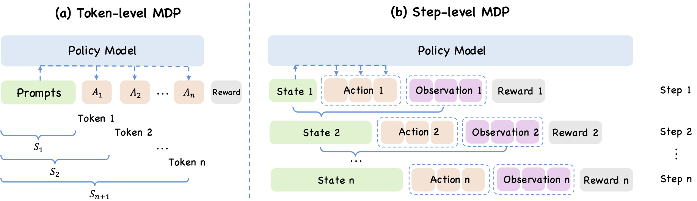
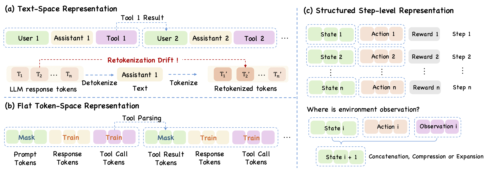
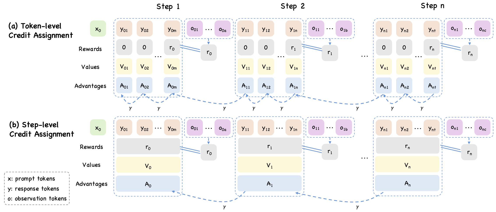

# Step-Level Training Logic

As large language models evolve from single-turn assistants into multi-step agents, reinforcement learning is no longer optimizing only a final response or a short reasoning trace. In agent settings, the model repeatedly receives observations, emits actions, calls tools, and accumulates consequences over multiple rounds of interaction. Once optimization targets this regime, the central question is no longer only how to score an answer, but how to define the decision process itself, how to represent the resulting trajectory, and how to propagate delayed reward across it.

The position taken in Agent-R1 is that these questions should be answered at the same semantic level: the interaction step. The step, rather than the individual token, is the natural unit at which agent behavior becomes legible as decision making. This view leads to a coordinated shift in three places. First, the Markov decision process should be formulated at the step level rather than the token level. Second, trajectory representation should preserve step boundaries rather than collapse the whole interaction into reconstructed messages or a single append-only token stream. Third, credit assignment should propagate reward across interaction steps rather than only across tokens or whole trajectories. The three parts are conceptually distinct, but they support one another. Step-level MDP without step-aware replay remains empirically fragile, while step-level MDP without step-level credit assignment still attributes reward through the wrong unit.

## From Token-Level MDP to Step-Level MDP

Token-level Markov decision process formulation is a natural extension of autoregressive language modeling. If a model generates a response one token at a time, then each partial prefix can be treated as a state and each next token as an action. This formulation remains clean and effective for single-turn post-training settings in which the environment is static or only weakly coupled to intermediate generations.

However, long-horizon agents do not interact with the world merely by appending one more token to a growing sequence. They call tools, receive observations, revise plans, restructure context, and branch on external outcomes. In such settings, the semantically meaningful transition is no longer "emit one token," but "complete one interaction round and receive new environment feedback." When optimization remains purely token-centric, high-level decisions are fragmented across many low-level actions, and the role of the environment is obscured inside one long flat trace.

Agent-R1 therefore adopts a step-level MDP view. At step $t$, the state $s_t$ is the observation presented to the policy, the action $a_t$ is the complete response or interaction action emitted at that step, and the environment returns reward $r_t$ together with the next observation $s_{t+1}$. What changes is not whether tokens still exist inside the model, but the unit at which the RL transition is defined. The transition is one interaction step rather than one appended token.

Comparison between token-level MDP formulation and step-level MDP formulation. The key shift is that the atomic action changes from a single token to a complete agent-environment interaction step.

This reformulation clarifies the division of responsibility between policy and environment. The policy chooses an action conditioned on the current observation. The environment is then responsible for executing that action, producing feedback, and constructing the next observation. Once the interaction round is treated as the transition unit, context summarization, truncation, tool execution, and other environment-mediated operations become part of the transition function rather than awkward exceptions to an append-only token view.

## Step-Level Trajectory Representation

Establishing a step-level MDP mathematically is not enough on its own. The empirical training pipeline must also record and replay trajectories in a way that respects the same step boundaries. This is the representation problem.

One common representation for multi-turn agents is a sequence of chat-style messages. This format is simple and interoperable with standard chat interfaces, but it hides a serious inconsistency. Rollout takes place in token space, whereas replay may reconstruct text and tokenize it again during optimization. Because the mapping from token sequence to text and back is not reversible in general, the replayed sequence may differ from the one that originally produced the trajectory. Once this retokenization drift occurs, masks, log-probabilities, and reward annotations can no longer be aligned reliably with the original rollout.

A stronger alternative is flat token-space storage, where prompts and responses are preserved directly as token IDs. This restores rollout-training consistency, but it still treats the whole interaction as one monolithic append-only sequence. That structure is workable for some training pipelines, yet it remains too rigid for long-horizon agents whose interaction history may need to be reconstructed, truncated, or reorganized at step boundaries.

The representation that best matches Agent-R1's perspective is therefore a structured step-level trajectory. Each interaction round is stored as a distinct unit containing the observation shown to the policy, the action produced at that step, and the reward or metadata attached to that interaction. This preserves token-level information inside each action while keeping the step itself explicit as the unit of replay and analysis.

The evolution of trajectory representation from message-based traces to token-space-consistent records and finally to step-based sequences.

The distinction matters because trajectory representation and MDP formulation answer different questions. MDP formulation defines what the RL transition is. Representation defines how the interaction history is stored and replayed for optimization. The two should not be conflated, but they must remain compatible. If the MDP is step-level while the replay format obscures or corrupts step boundaries, optimization is still misaligned with the underlying decision process.

## Step-Level Credit Assignment

Once the decision process is formulated at the step level and the trajectory is represented in a step-native form, reward propagation should also move to the same granularity. Otherwise, a mismatch remains between the unit at which decisions are modeled and the unit at which responsibility is assigned.

Trajectory-level credit assignment is too coarse for this purpose. Assigning one scalar signal to the whole rollout may be simple and stable, but it cannot distinguish productive intermediate actions from harmful ones when an episode contains many interaction rounds. Token-level credit assignment lies at the opposite extreme. It reuses the standard machinery of language-model RL, yet in agent settings it is often too fine. The strategically decisive event may be a retrieval call, a decomposition step, a context-management choice, or a tool invocation, while the reward arrives only later. If delayed return is attributed directly through surface tokens, the learning signal becomes diluted relative to the actual interaction choice.

The natural counterpart of a step-level MDP is therefore step-level credit assignment. In this view, value estimation, temporal-difference residuals, generalized advantage estimation, and PPO-style optimization are all organized around the interaction step. The policy may still factor internally over tokens, but the unit that receives advantage and responsibility is the complete interaction action rather than an isolated token.

Comparison of token-level, trajectory-level, and step-level credit assignment. The main change is not how actions are tokenized, but where delayed rewards are attributed and propagated.

This shift is especially important under delayed reward. In many agent tasks, the final outcome depends on an earlier decision that changes the entire later trajectory: choosing the right tool, retrieving the right evidence, or preserving the right context for subsequent turns. Step-level credit assignment makes it possible to attribute success or failure to that earlier interaction decision without collapsing the signal into one trajectory-level scalar or dispersing it across many locally meaningless token choices.

## Conclusion

The step-level perspective in Agent-R1 is not a single isolated design choice. It is a coordinated training logic. Once agent behavior is understood as multi-step interaction, the MDP transition, the trajectory representation, and the credit-assignment unit should all be aligned around the same object: the interaction step. This is the conceptual thread that connects the framework's modeling choices to its optimization logic, and it is the main reason the discussion naturally proceeds in the order of MDP, trajectory representation, and credit assignment.
