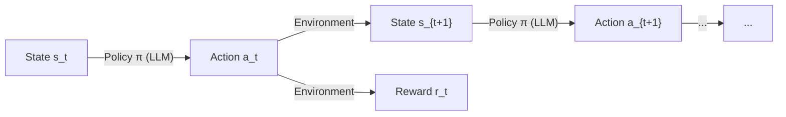
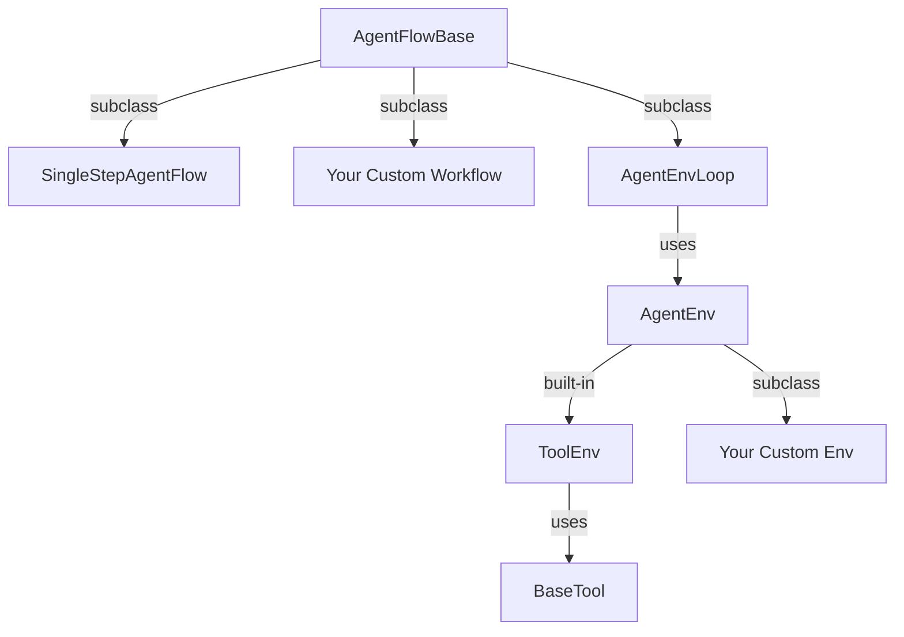

# Agent-R1

## Training Powerful LLM Agents with End-to-End Reinforcement Learning

Agent-R1 is an open-source framework designed to accelerate research and development at the critical intersection of **RL** and **Agent**. It employs end-to-end reinforcement learning to train agents in specific environments -- letting you define custom agents and environments, collect trajectories, and run scalable RL training loops to continuously improve your agents' performance.

<div class="grid cards" markdown>

-   :material-brain:{ .lg .middle } **Step-level MDP**

    ---

    A principled MDP formulation that enables flexible context management and per-step reward signals.

    [:octicons-arrow-down-24: Learn more](#step-level-mdp-formulation)

-   :material-layers-outline:{ .lg .middle } **Layered Abstractions**

    ---

    From maximum flexibility to out-of-the-box, choose the right level of abstraction for your use case.

    [:octicons-arrow-down-24: Learn more](#layered-abstractions)

</div>

---

## Step-level MDP Formulation

**A Principled Foundation for RL Agent Training**

Most existing frameworks treat the LLM agent as a token-level process: the "state" is the ever-growing concatenation of all past tokens, and the "action" is the next token. This token-level view forces context to grow monotonically and makes it hard to apply standard RL algorithms at a meaningful granularity.

Agent-R1 adopts a **step-level MDP** that models the LLM as an agent acting inside an environment:

| MDP Element | Definition |
|---|---|
| **State** \(s_t\) | The prompt presented to the LLM at step \(t\), determined entirely by the environment |
| **Action** \(a_t\) | The LLM's complete response at step \(t\) |
| **Transition** \(T(s_{t+1} \mid s_t, a_t)\) | The environment produces the next observation given the current state and the LLM's response |
| **Reward** \(r_t\) | A per-step reward signal from the environment |
| **Policy** \(\pi(a_t \mid s_t)\) | The LLM itself |



This formulation leads to three key insights:

!!! success "Flexible Context"
    Because the state \(s_t\) is provided by the environment -- not derived by concatenating all prior tokens -- the environment is free to **summarize**, **truncate**, **restructure**, or even **completely replace** the context between steps. As long as the transition function is well-defined, the MDP remains valid.

!!! success "Valid RL Training"
    Each step has its own observation, action, and reward. Log-probabilities are computed conditioned on \(s_t\) independently at each step, so standard policy gradient methods (PPO, GRPO, etc.) apply directly at the step level.

!!! success "Concat as a Special Case"
    The traditional "append everything" approach is simply one particular transition function: \(s_{t+1} = \text{concat}(s_t,\; a_t,\; \text{env\_output}_t)\). It is a valid but by no means the only choice. Agent-R1 supports it as a special case rather than a hard-wired constraint.

---

## Layered Abstractions

**From Maximum Flexibility to Out-of-the-Box**

Agent-R1 provides a **layered abstraction** system. Each layer adds more structure and convention while lowering the barrier to entry. Choose the level that matches your use case:



### Layer 1 -- AgentFlowBase (Maximum Flexibility)

Subclass `AgentFlowBase` directly to implement **any** agent logic. Each invocation of `run()` returns an `AgentFlowOutput` containing one or more `AgentFlowStep`s -- each with its own prompt, response, and reward.

This layer does **not** require an environment. It is ideal for fixed-pipeline workflows where each step simply uses a different prompt, or for any scenario where you need full control over the generation loop.

```python
from agent_r1.agent_flow import AgentFlowBase, AgentFlowOutput

class MyWorkflow(AgentFlowBase):
    async def run(self, sampling_params, **kwargs):
        # Full control: build prompts, call LLM, collect steps
        ...
        return AgentFlowOutput(steps=[step1, step2, ...], metrics=metrics)
```

### Layer 2 -- AgentEnvLoop + AgentEnv (Structured Interaction)

When your agent can be modelled as **interacting with an environment**, use the Gym-style `AgentEnv` interface. You only need to implement `reset()` and `step()` -- the framework handles the LLM generation loop, tokenization, and training data assembly.

```python
from agent_r1.env import AgentEnv, Observation, Action

@AgentEnv.register("my_env")
class MyEnv(AgentEnv):
    def reset(self, **kwargs) -> Observation:
        # Return the initial prompt for the LLM
        return Observation(messages=[...])

    async def step(self, action: Action) -> tuple[Observation, float, bool, dict]:
        # Process LLM response, return next observation + reward
        ...
        return Observation(messages=[...]), reward, done, info
```

### Layer 3 -- ToolEnv + BaseTool (Out-of-the-Box)

Multi-turn tool calling is the most common agent-environment interaction pattern. `ToolEnv` wraps the full tool-calling loop -- conversation history, tool-call parsing, response formatting -- so you only need to define the tools themselves:

```python
from agent_r1.tool import BaseTool, ToolResponse

@BaseTool.register("calculator")
class Calculator(BaseTool):
    name = "calculator"
    description = "Evaluate a math expression."
    parameters = {
        "type": "object",
        "properties": {
            "expression": {"type": "string", "description": "The math expression"}
        },
        "required": ["expression"],
    }

    async def execute(self, args, **kwargs) -> tuple[ToolResponse, float | None, dict]:
        result = eval(args["expression"])
        return ToolResponse(text=str(result)), None, {}
```

---

## Quick Start

Run a GRPO training loop on GSM8K with Qwen 2.5-3B in just one command:

```bash
python3 -m agent_r1.main_agent_ppo \
    algorithm.adv_estimator=grpo \
    data.train_files=$HOME/data/gsm8k/train.parquet \
    data.val_files=$HOME/data/gsm8k/test.parquet \
    actor_rollout_ref.model.path=Qwen/Qwen2.5-3B-Instruct \
    trainer.n_gpus_per_node=2 \
    trainer.total_epochs=15
```

See the full example script at [`examples/run_qwen2.5-3b.sh`](https://github.com/AgentR1/Agent-R1/blob/main/examples/run_qwen2.5-3b.sh).

---

<div style="text-align: center; color: #888; margin-top: 2em;" markdown>
Built on [verl](https://github.com/volcengine/verl){ target=_blank } -- a flexible, efficient RL training framework for LLMs.
</div>
