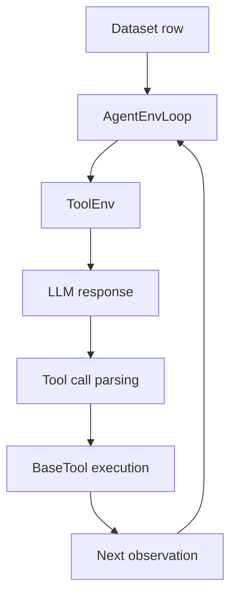

# Agent Task Tutorial

This tutorial follows the main Agent-R1 path: a **multi-step, tool-augmented agent task** built on `AgentEnvLoop` and `ToolEnv`.

The example uses GSM8K, but the important part is not the benchmark itself. The goal is to show how Agent-R1 turns a dataset row into an environment-driven, multi-step rollout.

Before starting this page, make sure the single-step [`Quick Start`](../getting-started/quick-start.md) already works in your environment.

## What You Will Run

This tutorial uses two existing files:

- dataset preprocessing: [`examples/data_preprocess/gsm8k_tool.py`](https://github.com/AgentR1/Agent-R1/blob/main/examples/data_preprocess/gsm8k_tool.py)
- training script: [`examples/run_qwen3-4b_gsm8k_tool.sh`](https://github.com/AgentR1/Agent-R1/blob/main/examples/run_qwen3-4b_gsm8k_tool.sh)

## 1. Prepare the Agent Dataset

Generate the tool-augmented GSM8K dataset:

```bash
python3 examples/data_preprocess/gsm8k_tool.py --local_save_dir ~/data/gsm8k_tool
```

Compared with the single-step sanity-check dataset, this preprocessing script adds two fields that make the task agentic:

- `agent_name: "agent_env_loop"`
- `env_kwargs` with `env_type: "tool"` and the tool configuration

A representative `env_kwargs` payload looks like this:

```json
{
  "env_type": "tool",
  "tools": ["calc_gsm8k_reward"],
  "tool_format": "hermes",
  "tools_kwargs": {
    "ground_truth": "18"
  }
}
```

The important idea is that the dataset row now carries rollout-time environment instructions, not just a prompt.

Conceptually, each sample says:

1. use the `agent_env_loop` rollout logic
2. instantiate a `tool` environment
3. expose the `calc_gsm8k_reward` tool inside that environment

## 2. Launch the Agent Task Training Script

Run:

```bash
bash examples/run_qwen3-4b_gsm8k_tool.sh
```

This script switches the rollout from single-step generation to the agent loop:

```bash
actor_rollout_ref.rollout.agent.default_agent_flow=agent_env_loop \
actor_rollout_ref.rollout.agent.max_steps=5 \
```

It also points the trainer to the tool dataset:

```bash
data.train_files=$HOME/data/gsm8k_tool/train.parquet \
data.val_files=$HOME/data/gsm8k_tool/test.parquet \
```

Before running, update at least these values in the script:

- `CUDA_VISIBLE_DEVICES`
- `actor_rollout_ref.model.path`
- `trainer.n_gpus_per_node`
- dataset paths if you saved the parquet files elsewhere

The most important Agent-R1-specific knobs in this script are:

| Setting | Why it matters |
| --- | --- |
| `actor_rollout_ref.rollout.agent.default_agent_flow=agent_env_loop` | enables the multi-step agent loop instead of the single-step flow |
| `actor_rollout_ref.rollout.agent.max_steps=5` | bounds the number of environment interactions per sample |
| `actor_rollout_ref.rollout.prompt_length=4096` | limits how much multi-step history can be fed back into the model |
| `actor_rollout_ref.rollout.response_length=2048` | limits each step's model output |
| `data.return_raw_chat=True` | keeps chat-style messages available to the environment and tokenizer pipeline |

## 3. What Happens During One Trajectory

At a high level, one sample follows this path:



More concretely:

1. `AgentEnvLoop` reads `env_kwargs` from the dataset row.
2. `AgentEnv.from_config(env_type="tool", ...)` creates a `ToolEnv`.
3. `ToolEnv.reset()` starts from the sample's prompt messages.
4. The LLM produces a response.
5. `ToolEnv.step()` parses tool calls from the response and executes the registered tool.
6. The formatted tool feedback is appended to the conversation as the next observation.
7. The loop continues until the environment returns `done=True` or `max_steps` is reached.

## 4. Where the Reward Comes From

The built-in GSM8K tool is registered as `calc_gsm8k_reward` in `agent_r1/tool/tools/gsm8k.py`.

Its role in this example is to:

- receive the model's proposed answer
- compare it with the sample's ground truth
- return tool text back into the conversation

One implementation detail matters here: the current GSM8K tool computes correctness internally, but the tool currently returns that diagnostic information as text plus `extra_info`, not as a non-`None` `reward_score`.

So the key lesson of this tutorial is not "this exact tool already exposes a dense scalar reward." The important part is that Agent-R1's `ToolEnv` interface can execute tools during rollout and can propagate tool-side feedback back into the trajectory. If your task needs explicit scalar rewards from tools, the interface supports it.

This is what makes the tutorial useful for Agent-R1: the model is not just generating one final answer, it is interacting with an environment that can evaluate and feed back information across multiple steps.

## 5. Why This Tutorial Matters More Than the Single-Step Script

The single-step GSM8K script is still useful, but only as a setup check. This tutorial is closer to the actual design center of Agent-R1 because it demonstrates:

- a step-level environment transition
- a multi-step agent loop
- tool-augmented interaction
- environment-mediated feedback attached to multi-step behavior

## 6. How to Adapt This Pattern to Your Own Task

To turn a new task into an Agent-R1 task, you usually need to change three layers:

1. **Dataset preprocessing**: emit rows that include `prompt`, `agent_name`, and `env_kwargs`.
2. **Environment or tools**: register a new `AgentEnv` or `BaseTool` implementation that defines how the agent interacts with the task.
3. **Training script**: point `data.train_files` and `data.val_files` to your dataset, then set rollout limits that fit your task length.

If your task is still single-turn, the quick start style is enough. If your task needs tool use, observation updates, or branching interactions, `AgentEnvLoop` is the right starting point.

## 7. Debugging Checklist

If this tutorial does not run as expected, check these in order:

- the dataset was generated under `~/data/gsm8k_tool` or your script points elsewhere
- the visible GPU count matches `trainer.n_gpus_per_node`
- `actor_rollout_ref.model.path` points to a real model checkpoint
- `env_kwargs` contains `env_type`, the tool name, and any required `tools_kwargs`
- prompt or response lengths are not too large for your hardware

Most first-run issues are configuration mismatches, not framework bugs.

## 8. Where to Look Next

- Read [`Step-level MDP`](../core-concepts/step-level-mdp.md) to connect this tutorial to the core RL formulation.
- Read [`Layered Abstractions`](../core-concepts/layered-abstractions.md) to see why this example maps naturally to `AgentEnvLoop + ToolEnv`.
- Keep [`Troubleshooting`](../getting-started/troubleshooting.md) nearby while customizing the example for your own task.
