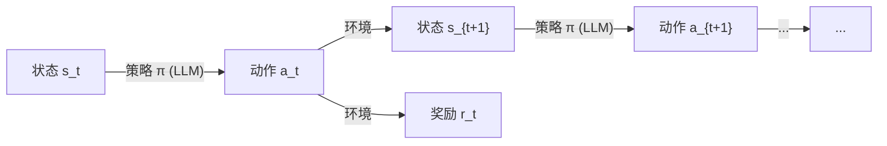
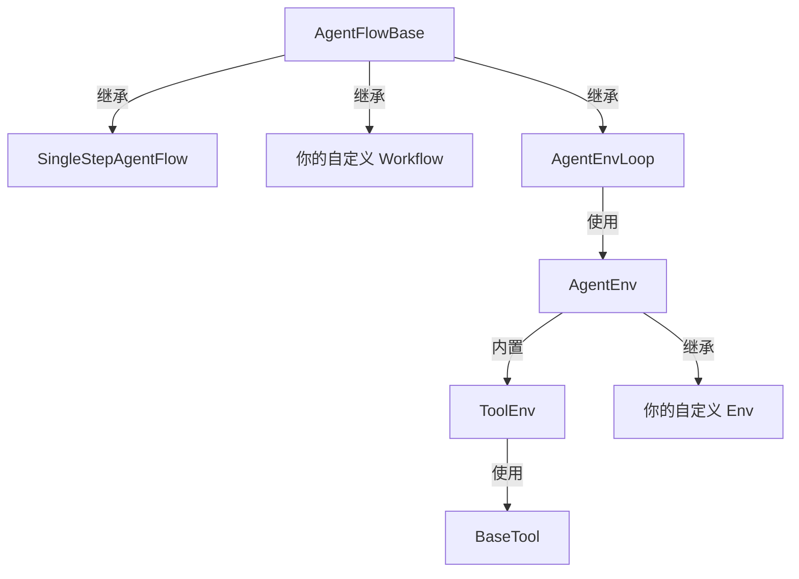

# Agent-R1

## 端到端强化学习训练强大的 LLM Agent

Agent-R1 是一个开源框架，旨在加速 **RL** 与 **Agent** 交叉领域的研究和开发。它采用端到端强化学习在特定环境中训练 Agent —— 让你定义自定义的 Agent 和环境、采集轨迹，并运行可扩展的 RL 训练循环来持续提升 Agent 的表现。

<div class="grid cards" markdown>

-   :material-brain:{ .lg .middle } **Step-level MDP**

    ---

    严谨的 MDP 建模，支持灵活的上下文管理和逐步奖励信号。

    [:octicons-arrow-down-24: 了解更多](#step-level-mdp)

-   :material-layers-outline:{ .lg .middle } **分层抽象**

    ---

    从最大灵活性到开箱即用，为不同场景选择合适的抽象层级。

    [:octicons-arrow-down-24: 了解更多](#layered-abstractions)

</div>

---

## Step-level MDP

**Agent RL 训练的理论基础**

大多数现有框架将 LLM Agent 视为一个 token 级别的过程：「状态」是所有历史 token 的拼接，「动作」是下一个 token。这种 token-level 的视角导致上下文只能单调增长，也难以在有意义的粒度上应用标准 RL 算法。

Agent-R1 采用 **step-level MDP**，将 LLM 建模为在环境中行动的 Agent：

| MDP 元素 | 定义 |
|---|---|
| **状态** \(s_t\) | 环境在第 \(t\) 步提供给 LLM 的输入（prompt），内容完全由环境决定 |
| **动作** \(a_t\) | LLM 在第 \(t\) 步的完整生成（response） |
| **转移** \(T(s_{t+1} \mid s_t, a_t)\) | 环境根据当前状态和 LLM 的响应，产生下一个观测 |
| **奖励** \(r_t\) | 每步独立的奖励信号 |
| **策略** \(\pi(a_t \mid s_t)\) | LLM 本身 |



这一建模带来三个关键洞察：

!!! success "灵活的上下文"
    因为状态 \(s_t\) 由环境提供 —— 而非通过拼接所有历史 token 得到 —— 环境可以自由地对上下文进行**摘要**、**截断**、**重组**，甚至**完全替换**。只要转移函数是良定义的，MDP 就是有效的。

!!! success "有效的 RL 训练"
    每一步都有独立的观测、动作和奖励。Log-probability 在给定 \(s_t\) 下独立计算，因此标准的策略梯度方法（PPO、GRPO 等）可以直接在 step 级别上应用。

!!! success "拼接只是特例"
    传统的「把所有内容拼在一起」的方式只是一种特定的转移函数：\(s_{t+1} = \text{concat}(s_t,\; a_t,\; \text{env\_output}_t)\)。它是一种合理但绝非唯一的选择。Agent-R1 将其作为特例支持，而非硬编码的约束。

---

## 分层抽象 { #layered-abstractions }

**从最大灵活性到开箱即用**

Agent-R1 提供了一套**分层抽象**体系。每一层在增加结构和约定的同时，降低接入门槛。选择最适合你场景的抽象层级：



### 第一层 —— AgentFlowBase（最大灵活性）

直接继承 `AgentFlowBase` 来实现**任意** Agent 逻辑。每次调用 `run()` 返回一个 `AgentFlowOutput`，其中包含一个或多个 `AgentFlowStep` —— 每个 Step 拥有独立的 prompt、response 和 reward。

这一层**不需要环境**，非常适合固定流程的 workflow（每步使用不同的 prompt），或任何需要完全控制生成循环的场景。

```python
from agent_r1.agent_flow import AgentFlowBase, AgentFlowOutput

class MyWorkflow(AgentFlowBase):
    async def run(self, sampling_params, **kwargs):
        # 完全控制：构建 prompt、调用 LLM、收集 step
        ...
        return AgentFlowOutput(steps=[step1, step2, ...], metrics=metrics)
```

### 第二层 —— AgentEnvLoop + AgentEnv（结构化交互）

当你的 Agent 可以建模为**与环境交互**时，使用 Gym 风格的 `AgentEnv` 接口。你只需实现 `reset()` 和 `step()` —— 框架会自动处理 LLM 生成循环、分词和训练数据组装。

```python
from agent_r1.env import AgentEnv, Observation, Action

@AgentEnv.register("my_env")
class MyEnv(AgentEnv):
    def reset(self, **kwargs) -> Observation:
        # 返回给 LLM 的初始 prompt
        return Observation(messages=[...])

    async def step(self, action: Action) -> tuple[Observation, float, bool, dict]:
        # 处理 LLM 的响应，返回下一个观测 + 奖励
        ...
        return Observation(messages=[...]), reward, done, info
```

### 第三层 —— ToolEnv + BaseTool（开箱即用）

多轮工具调用是最常见的 Agent 环境交互模式。`ToolEnv` 封装了完整的工具调用循环 —— 对话历史管理、工具调用解析、响应格式化 —— 你只需定义工具本身：

```python
from agent_r1.tool import BaseTool, ToolResponse

@BaseTool.register("calculator")
class Calculator(BaseTool):
    name = "calculator"
    description = "计算数学表达式。"
    parameters = {
        "type": "object",
        "properties": {
            "expression": {"type": "string", "description": "数学表达式"}
        },
        "required": ["expression"],
    }

    async def execute(self, args, **kwargs) -> tuple[ToolResponse, float | None, dict]:
        result = eval(args["expression"])
        return ToolResponse(text=str(result)), None, {}
```

---

## 快速开始

使用 Qwen 2.5-3B 在 GSM8K 上运行 GRPO 训练，只需一条命令：

```bash
python3 -m agent_r1.main_agent_ppo \
    algorithm.adv_estimator=grpo \
    data.train_files=$HOME/data/gsm8k/train.parquet \
    data.val_files=$HOME/data/gsm8k/test.parquet \
    actor_rollout_ref.model.path=Qwen/Qwen2.5-3B-Instruct \
    trainer.n_gpus_per_node=2 \
    trainer.total_epochs=15
```

完整示例脚本见 [`examples/run_qwen2.5-3b.sh`](https://github.com/AgentR1/Agent-R1/blob/main/examples/run_qwen2.5-3b.sh)。

---

<div style="text-align: center; color: #888; margin-top: 2em;" markdown>
基于 [verl](https://github.com/volcengine/verl){ target=_blank } 构建 —— 一个灵活、高效的 LLM 强化学习训练框架。
</div>
